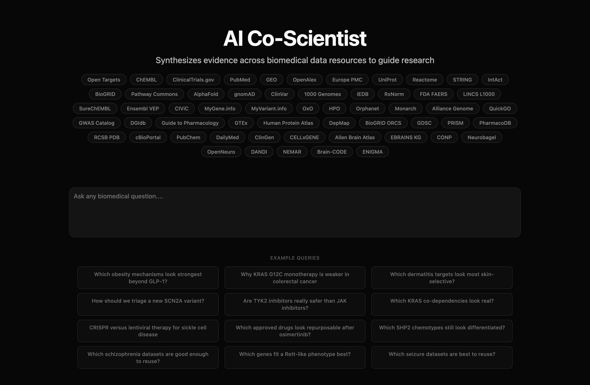
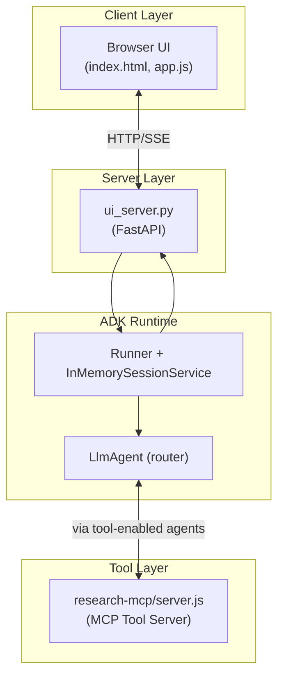
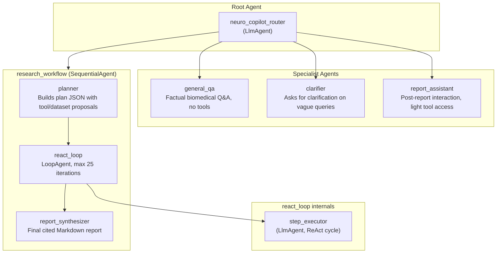
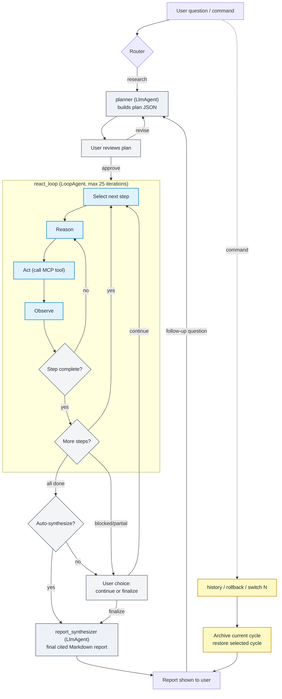

# Neuro Copilot

Neuro Copilot is a human-guided biomedical research assistant built on Google ADK that unifies 53 biomedical data sources behind a single conversational interface. It turns a plain-language research question into an investigation plan, queries the right databases and public datasets, and delivers a cited report for target discovery and pre-clinical decision support.

Lineage: this project continues from [AI Co-Scientist](https://github.com/povilaskarvelis/ai-co-scientist), rebranded and maintained here as Neuro Copilot.



### Databases

| Category | Sources |
|----------|---------|
| **Genomics, Transcriptomics & Variants** | Open Targets Platform, gnomAD, 1000 Genomes, Gene Expression Omnibus (GEO), Ensembl VEP, MyVariant.info, MyGene.info |
| **Identifiers, Ontologies & Phenotypes** | OxO, QuickGO, Human Phenotype Ontology (HPO), Orphanet / ORDO, Monarch Initiative |
| **Model Organisms & Translational Evidence** | Alliance Genome Resources |
| **Clinical Trials** | ClinicalTrials.gov |
| **Literature & Researchers** | PubMed, OpenAlex, Europe PMC |
| **Protein Structure & Function** | AlphaFold, RCSB PDB, UniProt, Human Protein Atlas |
| **Pathways & Interactions** | Reactome, STRING, Pathway Commons, IntAct, BioGRID |
| **Chemistry & Bioactivity** | ChEMBL, PubChem, SureChEMBL |
| **Safety & Regulatory** | FDA FAERS, RxNorm, DailyMed |
| **Drug Response & Pharmacogenomics** | GDSC / CancerRxGene, PRISM Repurposing, PharmacoDB |
| **Immunology** | IEDB |
| **Perturbation Signatures** | LINCS L1000 |
| **Clinical Variant Interpretation** | CIViC, ClinVar, ClinGen |
| **Cancer Genomics** | cBioPortal |
| **Target Discovery & Druggability** | GWAS Catalog, DGIdb, GTEx, DepMap, Guide to Pharmacology, BioGRID ORCS |
| **Single-Cell Atlases** | CELLxGENE Discover / Census |
| **Neuroscience Atlases & Knowledge Graphs** | Allen Brain Atlas, EBRAINS Knowledge Graph, CONP, Neurobagel, OpenNeuro, DANDI, NEMAR, Brain-CODE, ENIGMA |

This stack combines live REST APIs (literature, trials, identifiers/ontologies, protein/pathway, single-cell, neuroscience) with BigQuery public datasets (genomics, chemistry, safety, perturbation, and patent-derived chemistry).

## Architecture

The system uses a **router-based agent architecture**: a top-level intent classifier routes user messages to specialist agents. Research questions enter the full evidence-gathering pipeline; factual Q&A, clarification prompts, and post-report follow-ups go to lighter-weight agents.

### High-Level Architecture



### Agent Hierarchy



**Router behavior:** The router uses a fast model (`ADK_ROUTER_MODEL`) to classify intent. It transfers to `general_qa` for straightforward knowledge questions, `clarifier` for ambiguous queries, `report_assistant` when the user is asking about an existing report, and `research_workflow` for full evidence-gathering investigations. In-workflow commands (approve, continue, finalize, etc.) bypass the router LLM and go directly to `research_workflow`.

The primary runtime is the custom web UI in `adk-agent/ui/`, served by `adk-agent/ui_server.py`. That server manages conversations, state persistence, run orchestration, and PDF export on top of the Google ADK `Runner`. The source of truth for agent behavior is `adk-agent/neuro_copilot/workflow.py`.

## Dynamic Workflow

The **research_workflow** is the main evidence-gathering pipeline. It runs only when the router transfers to it (research questions, workflow commands, or in-progress continuation).



### ReAct Execution Loop

Each plan step is executed as a **Reason → Act → Observe** cycle inside a `LoopAgent`:

1. **Reason** — the step executor reads the current step goal and decides what tool to call and why
2. **Act** — calls an MCP tool (e.g., `search_pubmed`, `run_bigquery_select_query`)
3. **Observe** — reviews the tool results; if insufficient, reasons again and retries with a different query or tool
4. **Conclude** — when the step's completion condition is met, returns a structured result with a `reasoning_trace`

The reasoning trace captures the full decision chain per step and is stored alongside step results. The synthesizer uses these traces to ground source citations in the final report.

**Error recovery:** if the executor returns invalid output, the loop retries the step (up to 3 attempts) with a corrective prompt before marking it blocked and advancing.

## Available Tools

### MCP Tools (Live APIs)

| Category | Tools | Source |
|----------|-------|--------|
| **Clinical Trials** | `search_clinical_trials`, `get_clinical_trial`, `summarize_clinical_trials_landscape` | ClinicalTrials.gov |
| **Literature** | `search_pubmed`, `search_pubmed_advanced`, `get_pubmed_abstract`, `get_paper_fulltext` | PubMed / PMC (NCBI E-utilities) |
| **Literature Enrichment** | `search_europe_pmc_literature` | Europe PMC (preprints, citation counts, open-access metadata, broader article coverage) |
| **Immunology** | `search_iedb_epitope_evidence` | IEDB (epitope summaries, MHC ligand evidence, T-cell assay evidence, PMIDs) |
| **Transcriptomics** | `search_geo_datasets`, `get_geo_dataset` | NCBI Gene Expression Omnibus (GEO; series, samples, platforms, curated datasets) |
| **Researcher Discovery** | `search_openalex_works`, `search_openalex_authors`, `rank_researchers_by_activity`, `get_researcher_contact_candidates` | OpenAlex |
| **Gene ID Normalization** | `resolve_gene_identifiers` | MyGene.info |
| **Ontology Crosswalks** | `map_ontology_terms_oxo` | EBI OxO |
| **Phenotypes & Rare Disease** | `search_hpo_terms`, `get_orphanet_disease_profile`, `query_monarch_associations` | HPO via EBI OLS, Orphanet / ORDO, Monarch Initiative |
| **Translational Model Evidence** | `get_alliance_genome_gene_profile` | Alliance Genome Resources (orthologs, disease/phenotype summaries, and disease models across model-organism resources) |
| **Gene Ontology** | `search_quickgo_terms`, `get_quickgo_annotations` | QuickGO |
| **Protein Annotations** | `search_uniprot_proteins`, `get_uniprot_protein_profile` | UniProt REST |
| **Pathways & Networks** | `search_reactome_pathways`, `get_string_interactions`, `get_intact_interactions`, `get_biogrid_interactions`, `search_pathway_commons_top_pathways` | Reactome, STRING, IntAct, BioGRID, Pathway Commons |
| **Variant Predictions** | `annotate_variants_vep` | Ensembl VEP (SIFT, PolyPhen, AlphaMissense) |
| **Variant Annotations** | `get_variant_annotations` | MyVariant.info (ClinVar, CADD, dbSNP, gnomAD, COSMIC) |
| **Clinical Variants** | `search_civic_variants`, `search_civic_genes` | CIViC (cancer variant interpretations) |
| **Curated Gene Curation** | `get_clingen_gene_curation` | ClinGen (gene-disease validity, dosage sensitivity) |
| **Protein Structures** | `get_alphafold_structure` | AlphaFold API (pLDDT confidence, PDB/CIF files) |
| **GWAS Associations** | `search_gwas_associations` | EBI GWAS Catalog (trait-variant associations, p-values, odds ratios) |
| **Drug-Gene Interactions** | `search_drug_gene_interactions` | DGIdb (druggability categories, approved/experimental drugs) |
| **Curated Pharmacology** | `get_guidetopharmacology_target` | Guide to Pharmacology (curated target-ligand interactions, action types, affinity evidence) |
| **Tissue Expression** | `get_gene_tissue_expression` | GTEx v8 (median TPM across 54 human tissues) |
| **Protein Atlas** | `get_human_protein_atlas_gene` | Human Protein Atlas (tissue specificity, single-cell specificity, subcellular localization, protein class) |
| **Dependency & Vulnerability** | `get_depmap_gene_dependency` | DepMap (CRISPR/RNAi dependency fractions, pan-dependency/selectivity, predictive features) |
| **Published CRISPR Screens** | `get_biogrid_orcs_gene_summary` | BioGRID ORCS (screen-level hit status, phenotypes, cell lines, methodologies, and score summaries across published CRISPR screens) |
| **Drug Response** | `get_gdsc_drug_sensitivity`, `get_prism_repurposing_response`, `get_pharmacodb_compound_response` | GDSC / CancerRxGene (compound sensitivity across cancer cell lines, IC50/AUC patterns, tissue-level pharmacogenomics); Broad PRISM Repurposing (single-dose log2-fold-change viability across pooled cell lines); PharmacoDB (harmonized cross-dataset response across GDSC, PRISM, CTRPv2, and related public screens) |
| **Experimental Structures** | `search_protein_structures` | RCSB PDB (X-ray, cryo-EM structures, resolution, ligands) |
| **Cancer Mutations** | `get_cancer_mutation_profile` | cBioPortal (TCGA Pan-Cancer mutation frequencies, hotspots) |
| **Bioactivity** | `get_chembl_bioactivities` | ChEMBL API (IC50/Ki/Kd, target selectivity, assay metadata) |
| **Chemical Compounds** | `get_pubchem_compound` | PubChem (116M+ compounds, molecular properties, SMILES, drug-likeness) |
| **Safety Signals** | `search_fda_adverse_events` | openFDA FAERS (post-marketing adverse event reports) |
| **Drug Labels** | `get_dailymed_drug_label` | DailyMed SPL labels (boxed warnings, indications, contraindications, warnings/precautions) |
| **Single-Cell Dataset Discovery** | `search_cellxgene_datasets` | CELLxGENE Discover / Census public metadata (cell types, tissues, diseases, assay, organism) |
| **Brain Atlases** | `search_aba_genes`, `search_aba_structures`, `get_aba_gene_expression`, `search_aba_differential_expression` | Allen Brain Atlas (structure ontology, ISH expression, differential enrichment) |
| **Neuroscience Knowledge Graph** | `search_ebrains_kg`, `get_ebrains_kg_document` | EBRAINS KG (datasets, models, software, contributors, projects) |
| **Neuroscience Datasets (CONP)** | `search_conp_datasets`, `get_conp_dataset_details` | CONP datasets via `conpdatasets` GitHub catalog |
| **Cohort Discovery (Neurobagel)** | `query_neurobagel_cohorts` | Neurobagel public node API (harmonized cohort-level dataset discovery) |
| **Neuroimaging Datasets (OpenNeuro)** | `search_openneuro_datasets`, `get_openneuro_dataset` | OpenNeuro GraphQL (BIDS fMRI/MRI/MEG/EEG datasets by keyword and/or modality, with pagination and metadata inspection) |
| **Neurophysiology (DANDI)** | `search_dandi_datasets`, `get_dandi_dataset` | DANDI Archive REST API (electrophysiology, calcium imaging, NWB/BIDS) |
| **Neuroelectromagnetic (NEMAR)** | `search_nemar_datasets`, `get_nemar_dataset_details` | NEMAR (EEG/MEG/iEEG from OpenNeuro, nemarDatasets GitHub, BIDS, HED) |
| **Brain-CODE (OBI)** | `search_braincode_datasets`, `get_braincode_dataset_details` | Brain-CODE via CONP (Ontario Brain Institute: epilepsy, depression, neurodegeneration, CP, concussion) |
| **ENIGMA Consortium** | `search_enigma_datasets`, `get_enigma_dataset_info` | ENIGMA Toolbox (100+ case-control imaging genetics meta-analyses: schizophrenia, depression, ADHD, epilepsy) |
| **Benchmarks** | `benchmark_dataset_overview`, `check_gpqa_access` | Hugging Face Datasets |

### BigQuery Datasets

All accessed via `list_bigquery_tables` and `run_bigquery_select_query` with read-only row/bytes guardrails.

| Dataset | Contents |
|---------|----------|
| **open_targets_platform** | Disease-target associations, genetic evidence, drugs, tractability |
| **ebi_chembl** | Bioactive compounds, target bioactivity (IC50/Ki/EC50), mechanism of action |
| **gnomad** | Population variant frequencies across diverse ancestries |
| **human_genome_variants** | 1000 Genomes Phase 3 variants, Platinum Genomes, Simons Diversity |
| **human_variant_annotation** | ClinVar clinical significance classifications, variant-condition associations (hg19/hg38) |
| **nlm_rxnorm** | Drug nomenclature, ingredient relationships, clinical drug pathways |
| **fda_drug** | FAERS adverse event reports, drug labels, NDC listings, enforcement actions |
| **umiami_lincs** | L1000 perturbation signatures: cell lines, small molecules, readouts |
| **ebi_surechembl** | Chemical structures extracted from patents |

## User Commands

| Command | When | What it does |
|---------|------|-------------|
| `approve` / `yes` / `lgtm` / `go ahead` | Plan pending approval | Approve the plan and start execution |
| *(any other text while plan is pending)* | Plan pending approval | Treat as revision feedback — planner regenerates |
| `continue` / `next` / `go` | Execution paused | Resume executing remaining plan steps |
| `finalize` / `summarize now` | Any time after execution | Skip remaining steps and generate final report |
| `history` | Any time | List all archived + active research cycles |
| `rollback` | Any time | Archive current cycle and restore the most recent prior cycle |
| `switch N` | Any time | Archive current cycle and restore cycle number N |
| *(new question)* | After a report | Archives current cycle, starts fresh planning |

## Guardrails

- **HITL plan gate** — `before_agent_callback` blocks the ReAct loop and synthesizer until the plan is approved.
- **ReAct retry** — parse/validation errors trigger automatic retry (up to 3 attempts per step) before marking the step blocked.
- **Error callbacks** — `on_model_error_callback` and `on_tool_error_callback` surface rate-limit and tool failures to the user instead of silently crashing.
- **Step renumbering** — follow-up plans with non-sequential IDs are canonically renumbered to `S1, S2, ...`.
- **Source citations** — final reports cite human-readable database names (PubMed, ClinicalTrials.gov, etc.), never raw tool names or JSON URLs.
- **Research history** — up to 10 prior research cycles are archived with full state; rollback restores any previous cycle.
- **BigQuery guardrails** — read-only queries with configurable max rows (default 200, hard cap 1000) and bytes-billed limits.
- **Source precedence policy** — overlapping tools are given explicit routing guidance so the planner/executor prefer the right source for each evidence type (for example IntAct vs STRING, DailyMed vs FAERS, PubMed vs Europe PMC).

## Quick Start

### Prerequisites
- Python 3.10+
- Node.js 18+
- Optional local auth: Google API key ([get one free](https://aistudio.google.com/apikey))
- Optional Vertex auth: `gcloud` CLI + Application Default Credentials

### Setup

```bash
# 1. Clone and install
git clone <repo-url>
cd <repo>

# 2. Create and activate a project virtualenv
python -m venv .venv
source .venv/bin/activate

# 3. Install MCP server dependencies
cd research-mcp
npm install

# 4. Install agent dependencies
cd ../adk-agent
pip install -r requirements.txt

# 5a. Local mode auth (AI Studio API key)
cp .env.local.example .env
# then edit .env and set GOOGLE_API_KEY
# optional BioGRID integrations:
# set BIOGRID_ACCESS_KEY and/or BIOGRID_ORCS_ACCESS_KEY in .env
# optional for BigQuery tools (ADC):
# gcloud auth application-default login
# optional for gated Hugging Face datasets (e.g., GPQA):
# set HF_TOKEN in .env

# 5b. Vertex mode auth (project-backed)
cp .env.vertex.example .env
# then edit GOOGLE_CLOUD_PROJECT / GOOGLE_CLOUD_LOCATION
# optional BioGRID integrations:
# set BIOGRID_ACCESS_KEY and/or BIOGRID_ORCS_ACCESS_KEY in .env
# and authenticate with:
# gcloud auth application-default login
```

Keep the same shell with `.venv` activated for all commands below.

### Run

**Web UI (primary):**

```bash
cd adk-agent
python ui_server.py
```

Opens the custom web interface at `http://localhost:8080` with conversation management, real-time activity tracking, report panel, and PDF export.

**Runtime notes:**

- The UI server binds to `127.0.0.1:8080` by default. Override with `NEURO_COPILOT_UI_HOST` and `NEURO_COPILOT_UI_PORT` (legacy: `CO_SCI_UI_HOST` / `CO_SCI_UI_PORT`).
- Local task and conversation state is stored in `adk-agent/state/workflow_tasks.json` by default.
- To use Postgres-backed persistence instead of local JSON, set `NEURO_COPILOT_POSTGRES_DSN` (legacy: `AI_CO_SCIENTIST_POSTGRES_DSN`, or `POSTGRES_DSN` / `DATABASE_URL`).
- Generated Markdown/PDF reports are written to `adk-agent/reports/`.
- Planner skills are enabled by default. Set `ADK_PLANNER_SKILLS_ENABLED=0` to disable repo-local ADK planner skills.
- Executor lookup skills are enabled by default. Set `ADK_EXECUTION_SKILLS_ENABLED=0` to disable repo-local executor skills.
- Report-assistant follow-up skills are enabled by default. Set `ADK_REPORT_ASSISTANT_SKILLS_ENABLED=0` to disable repo-local report-assistant skills.

**ADK CLI / ADK Web UI (alternative):**

```bash
cd adk-agent
adk run neuro_copilot    # interactive terminal
adk web .               # ADK built-in web UI
```

**Standalone CLI wrapper:**

```bash
cd adk-agent
python agent.py
python agent.py --query "Evaluate LRRK2 as a drug target in Parkinson disease"
```

**Legacy minimal HTTP API:**

`adk-agent/server.py` exposes a smaller programmatic interface (`GET /healthz`, `POST /query`) if you explicitly run that app. It is not the default local or Cloud Run entrypoint.

It also exposes `POST /benchmark_query`, which uses a benchmark-optimized execution profile intended for direct database QA benchmarks such as LABBench2 `dbqa2`. This path bypasses the normal plan-and-report workflow and returns a compact direct answer.

Example benchmark query:

```bash
cd adk-agent
python agent.py --benchmark --query "What is the Open Targets Association Score for HTRA1 with vital capacity, according to the September 2025 release?"
```

## Cloud Run Deployment

```bash
PROJECT_ID="your-project-id" \
REGION="us-central1" \
SERVICE_NAME="neuro-copilot" \
bash scripts/deploy_cloud_run.sh
```

The deploy script builds a container image via Cloud Build, then deploys the primary `ui_server.py` app to Cloud Run with Vertex AI auth and the full BigQuery dataset allowlist pre-configured.

### Runtime endpoints (Cloud Run)
- `GET /` — primary web UI
- `GET /about` — static project overview page
- `GET /api/health` — readiness and runtime status
- `GET /api/rate-limit` — rate-limit window and remaining quota for the caller IP
- `POST /api/query` — start a new research question
- `GET /api/conversations` — list conversations owned by the caller IP
- `GET /api/conversations/{id}` — full conversation detail with iterations
- `GET /api/tasks/{id}` — task detail, active plan, report, and research log
- `POST /api/tasks/{id}/start` — start an approved task
- `POST /api/tasks/{id}/continue` — continue an in-progress task
- `POST /api/tasks/{id}/feedback` — send revision feedback or follow-up input
- `POST /api/tasks/{id}/revise` — request a scoped revision
- `GET /api/runs/{id}` — poll a run record
- `GET /api/tasks/{id}/report.pdf` — export report as PDF

## Project Structure

```
├── adk-agent/              # Neuro Copilot Agent (Python)
│   ├── agent.py            # ADK-native CLI wrapper (interactive/single query)
│   ├── ui_server.py        # Custom web UI server (FastAPI, primary entrypoint)
│   ├── report_pdf.py       # PDF report generation
│   ├── server.py           # Minimal FastAPI HTTP wrapper (legacy)
│   ├── neuro_copilot/
│   │   ├── __init__.py     # Exports root_agent for `adk run` / `adk web`
│   │   ├── workflow.py     # Workflow graph, HITL, history/rollback, callbacks
│   │   ├── skill_loader.py # Repo-local wrapper for loading ADK workflow skills
│   │   └── skills/         # Planner, executor, and report-assistant skill assets
│   ├── ui/
│   │   ├── index.html      # Landing page and chat interface
│   │   ├── about.html      # Static architecture / project overview page
│   │   ├── app.js          # Client-side application logic
│   │   └── styles.css      # UI styles
│   ├── state/              # Local JSON task/conversation state (runtime-created)
│   ├── reports/            # Generated Markdown/PDF reports (runtime-created)
│   ├── .adk/               # ADK local sessions/artifacts (created by `adk run` / `adk web`)
│   └── test_*.py           # Regression tests
│
├── research-mcp/           # Research Tools Server (Node.js)
│   ├── server.js           # MCP tool server (Allen + EBRAINS + biomedical tools)
│   └── test-tools.js       # Optional manual MCP tool test script
│
├── scripts/
│   └── deploy_cloud_run.sh # Build + deploy to Cloud Run with Vertex env
│
├── Dockerfile              # Cloud Run image (Python + Node runtime)
├── .dockerignore           # Build context guardrails
└── README.md               # This file
```

## Data Sources

The full tool catalog above is the authoritative source. The lists below highlight the major external sources this project currently uses.

### Representative Live APIs
- **[ClinicalTrials.gov](https://clinicaltrials.gov/)** — Clinical trial registry and results
- **[PubMed / NCBI](https://pubmed.ncbi.nlm.nih.gov/)** — Biomedical literature, abstracts, and PMC-linked open-access full text
- **[Gene Expression Omnibus (GEO)](https://www.ncbi.nlm.nih.gov/geo/)** — Functional genomics records across gene expression, microarray, and sequencing studies
- **[OpenAlex](https://openalex.org/)** — Scholarly works, authors, and citation data
- **[UniProt](https://www.uniprot.org/)** — Protein sequence, function, and annotation
- **[Reactome](https://reactome.org/)** — Curated biological pathway database
- **[STRING](https://string-db.org/)** — Protein-protein interaction networks
- **[MyVariant.info](https://myvariant.info/)** — Aggregated variant annotations across ClinVar/CADD/dbSNP/COSMIC
- **[GWAS Catalog](https://www.ebi.ac.uk/gwas/)** — Trait-variant associations with p-values and mapped genes
- **[DGIdb](https://dgidb.org/)** — Drug-gene interactions and druggability categories
- **[GTEx](https://gtexportal.org/)** — Tissue-level expression profiles across human tissues
- **[RCSB PDB](https://www.rcsb.org/)** — Experimentally resolved protein structures
- **[AlphaFold](https://alphafold.ebi.ac.uk/)** — Predicted protein structures and confidence scores
- **[cBioPortal](https://www.cbioportal.org/)** — Cancer mutation frequencies and hotspot profiles
- **[PubChem](https://pubchem.ncbi.nlm.nih.gov/)** — Compound structures and physicochemical metadata
- **[openFDA FAERS](https://open.fda.gov/apis/drug/event/)** — Post-marketing safety signal data
- **[Allen Brain Atlas](https://mouse.brain-map.org/)** — Brain structure ontology and ISH gene expression atlases
- **[EBRAINS Knowledge Graph](https://search.kg.ebrains.eu/)** — Neuroscience datasets, models, software, workflows, and contributors

### BigQuery Public Datasets
- **[Open Targets Platform](https://platform.opentargets.org/)** — Disease-target associations, genetic evidence, tractability
- **[ChEMBL](https://www.ebi.ac.uk/chembl/)** — Bioactive compound and target bioactivity data
- **[gnomAD](https://gnomad.broadinstitute.org/)** — Population variant frequencies
- **[1000 Genomes](https://www.internationalgenome.org/)** — Phase 3 variants, population structure
- **[ClinVar (BigQuery)](https://www.ncbi.nlm.nih.gov/clinvar/)** — Clinical significance labels and variant-condition mappings
- **[IEDB](https://www.iedb.org/)** — Immune epitope data, B-cell and T-cell assays
- **[RxNorm](https://www.nlm.nih.gov/research/umls/rxnorm/)** — Drug nomenclature and relationships
- **[FDA FAERS](https://open.fda.gov/data/faers/)** — Adverse event reports, drug labels, enforcement
- **[LINCS L1000](https://lincsproject.org/)** — Chemical and genetic perturbation signatures
- **[SureChEMBL](https://www.surechembl.org/)** — Chemical structures from patent literature

## Testing

```bash
cd adk-agent
python -m py_compile agent.py server.py ui_server.py report_pdf.py state_store.py neuro_copilot/workflow.py
python -m pytest test_tool_registry.py test_report_pdf.py test_ui_server_state.py test_workflow.py
```

Notes:
- External network tests were removed from the default suite to keep CI/dev runs deterministic and fast.
- `test_cli.py` is best treated as a manual smoke test rather than part of the default automated suite.
- Generated artifacts in `adk-agent/reports/` are runtime outputs and can be safely deleted.
