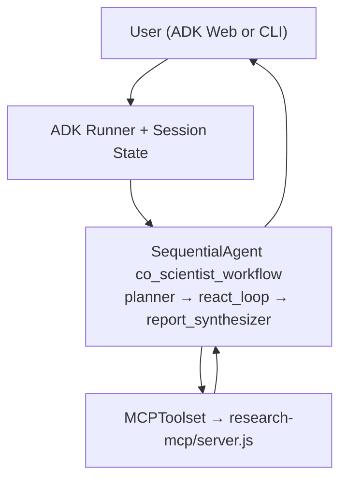
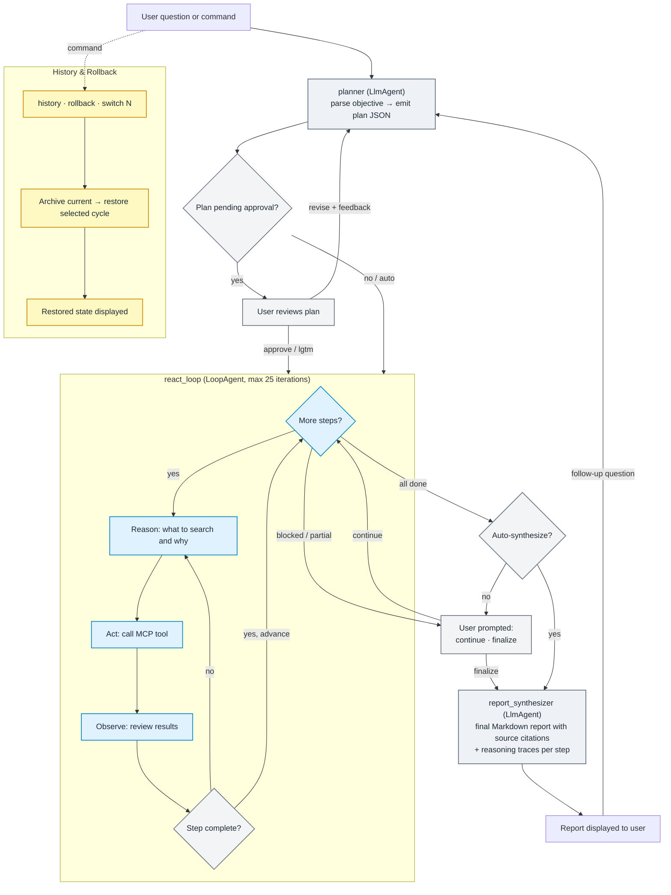

# AI Co-Scientist

An agentic AI co-investigator for scientific discovery and target evaluation.

## What It Does

The AI Co-Scientist helps researchers:
- **Discover drug targets** for diseases using Open Targets data
- **Evaluate druggability** of potential targets
- **Find clinical trial evidence** from ClinicalTrials.gov
- **Search scientific literature** via PubMed and Europe PMC preprints
- **Assess post-marketing safety and regulatory labels** via BigQuery (FDA drug data)
- **Generate a query-specific execution plan** with explicit tool proposals
- **Require human plan approval or revision** before evidence tools run
- **Run iterative evidence refinement loops** with tool-use guardrails
- **Synthesize structured final reports** with citations, limitations, and next actions

## Architecture



## Dynamic Workflow

Source of truth: `adk-agent/co_scientist/workflow.py`.



### ReAct Execution Loop

Each plan step is executed as a **Reason → Act → Observe** cycle inside a `LoopAgent`:

1. **Reason** — the step executor reads the current step goal and decides what tool to call and why
2. **Act** — calls an MCP tool (e.g., `search_pubmed`, `check_druggability`)
3. **Observe** — reviews the tool results; if insufficient, reasons again and retries with a different query or tool
4. **Conclude** — when the step's completion condition is met, returns a structured result with a `reasoning_trace`

The reasoning trace captures the full decision chain per step ("searched X because Y, found Z, concluded W") and is stored alongside step results. The synthesizer uses these traces to ground source citations in the final report.

**Error recovery:** if the executor returns invalid output, the loop retries the step (up to 3 attempts) with a corrective prompt before marking it blocked and advancing.

## User Commands

| Command | When | What it does |
|---------|------|-------------|
| `approve` / `yes` / `lgtm` / `go ahead` | Plan pending approval | Approve the plan and start execution |
| *(any other text while plan is pending)* | Plan pending approval | Treat as revision feedback — planner regenerates |
| `continue` / `next` / `go` | Execution paused | Resume executing remaining plan steps |
| `finalize` / `summarize now` | Any time after execution | Skip remaining steps and generate final report |
| `history` | Any time | List all archived + active research cycles |
| `rollback` | Any time | Archive current cycle and restore the most recent prior cycle |
| `switch N` | Any time | Archive current cycle and restore cycle number N |
| *(new question)* | After a report | Archives current cycle, starts fresh planning |

## Guardrails

- **HITL plan gate** — `before_agent_callback` blocks the ReAct loop and synthesizer until the plan is approved.
- **ReAct retry** — parse/validation errors trigger automatic retry (up to 3 attempts per step) before marking the step blocked.
- **Error callbacks** — `on_model_error_callback` and `on_tool_error_callback` surface rate-limit and tool failures to the user instead of silently crashing.
- **Step renumbering** — follow-up plans with non-sequential IDs are canonically renumbered to `S1, S2, ...`.
- **Source citations** — final reports cite human-readable database names (PubMed, ClinicalTrials.gov, etc.), never raw tool names or JSON URLs.
- **Research history** — up to 10 prior research cycles are archived with full state; rollback restores any previous cycle.

## Example Queries

```
Is PCSK9 likely to succeed in clinical trials for cardiovascular disease?
```
```
Find researchers who have published on idiopathic pulmonary fibrosis (IPF) treatment in the last 3 years
```
```
Evaluate LRRK2 as a drug target for Parkinson disease — what is the genetic evidence, druggability, and competitive landscape?
```
```
Compare BRCA1 and BRCA2 as therapeutic targets in ovarian cancer across genetic association, safety, and pipeline activity
```
```
What are the known safety liabilities of targeting JAK1 in rheumatoid arthritis, and how do they compare to IL-6 inhibition?
```

## Quick Start

### Prerequisites
- Python 3.10+
- Node.js 18+
- Optional local auth: Google API key ([get one free](https://aistudio.google.com/apikey))
- Optional Vertex auth: `gcloud` CLI + Application Default Credentials

### Setup

```bash
# 1. Clone and install
git clone <repo-url>
cd <repo>

# 2. Create and activate a project virtualenv
python -m venv .venv
source .venv/bin/activate

# 3. Install MCP server dependencies
cd research-mcp
npm install

# 4. Install agent dependencies
cd ../adk-agent
pip install -r requirements.txt

# 5a. Local mode auth (AI Studio API key)
cp .env.local.example .env
# then edit .env and set GOOGLE_API_KEY
# optional for BigQuery tools (ADC):
# gcloud auth application-default login
# optional for gated Hugging Face datasets (e.g., GPQA):
# set HF_TOKEN in .env
# optional dataset source overrides:
# HF_DATASET_PUBMEDQA, HF_DATASET_BIOASQ, HF_DATASET_GPQA

# 5b. Vertex mode auth (project-backed)
cp .env.vertex.example .env
# then edit GOOGLE_CLOUD_PROJECT / GOOGLE_CLOUD_LOCATION
# and authenticate with:
# gcloud auth application-default login
```

Keep the same shell with `.venv` activated for all commands below.

### Run

Primary (ADK-native CLI):

```bash
cd adk-agent
adk run co_scientist
```

Primary (ADK-native Web UI):

```bash
cd adk-agent
adk web .
```

Optional lightweight wrapper (still ADK-native under the hood):

```bash
cd adk-agent
python agent.py
python agent.py --query "Evaluate LRRK2 as a drug target in Parkinson disease"
```

## Vertex Transition (Hackathon-Ready)

### What is already prepared
- Dual auth support in the runner: local API key or Vertex env (`GOOGLE_GENAI_USE_VERTEXAI=true`).
- HTTP API entrypoint for deployment: `adk-agent/server.py`.
- Cloud Run containerization files: `Dockerfile`, `.dockerignore`.
- One-command deploy script: `scripts/deploy_cloud_run.sh`.
- BigQuery MCP tools: `list_bigquery_tables`, `run_bigquery_select_query` (read-only with row/bytes guardrails).
- BQ-first planning policy is on by default (`ADK_NATIVE_PREFER_BIGQUERY=1`), configurable per environment.
- Benchmark dataset tools (non-BQ): `benchmark_dataset_overview`, `sample_pubmedqa_examples`, `sample_bioasq_examples`, `check_gpqa_access`.

### Cloud Run deployment (when your hackathon project opens)

```bash
# From repo root
PROJECT_ID="your-hackathon-project-id" \
REGION="us-central1" \
SERVICE_NAME="ai-co-scientist" \
bash scripts/deploy_cloud_run.sh
```

### Runtime endpoints (Cloud Run)
- `GET /healthz` for readiness/config status
- `POST /query` with JSON body:
- API mode auto-approves plan confirmation gates (no interactive terminal prompt).

```json
{
  "query": "Evaluate LRRK2 as a drug target in Parkinson disease"
}
```

## Project Structure

```
├── adk-agent/              # AI Co-Scientist Agent (Python)
│   ├── agent.py            # ADK-native CLI wrapper (interactive/single query)
│   ├── server.py           # FastAPI HTTP wrapper for Cloud Run
│   ├── co_scientist/
│   │   ├── __init__.py     # Exports root_agent for `adk run` / `adk web`
│   │   └── workflow.py     # Workflow graph, HITL, history/rollback, callbacks
│   ├── .adk/               # ADK local sessions/artifacts (created at runtime)
│   └── test_*.py           # Core regression suite
│
├── research-mcp/           # Research Tools Server (Node.js)
│   ├── server.js           # MCP tool server
│   ├── data/               # Local datasets
│   └── test-tools.js       # Optional manual MCP tool test script
│
├── scripts/
│   └── deploy_cloud_run.sh # Build + deploy to Cloud Run with Vertex env
│
├── Dockerfile              # Cloud Run image (Python + Node runtime)
├── .dockerignore           # Build context guardrails
└── README.md               # This file
```

## Available Tools

| Category | Tools | API |
|----------|-------|-----|
| **Disease & Targets** | `search_diseases`, `search_disease_targets`, `get_target_info`, `search_targets` | Open Targets GraphQL |
| **Druggability** | `check_druggability`, `get_target_drugs` | Open Targets GraphQL |
| **Clinical Trials** | `search_clinical_trials`, `get_clinical_trial`, `summarize_clinical_trials_landscape` | ClinicalTrials.gov |
| **Post-Marketing Safety & Labels** | `run_bigquery_select_query` (fda_drug dataset) | BigQuery (FDA Drug) |
| **Chemistry Evidence** | `search_chembl_compounds_for_target` | ChEMBL |
| **Expression & Cell Context** | `summarize_target_expression_context` | Open Targets GraphQL |
| **Genetic Direction-of-Effect** | `infer_genetic_effect_direction` | GWAS Catalog |
| **Competitive & Safety Intelligence** | `summarize_target_competitive_landscape`, `summarize_target_safety_liabilities` | Open Targets GraphQL |
| **Comparative Prioritization** | `compare_targets_multi_axis` (auto mode from goal text, preset, or custom axis weights) | Open Targets GraphQL |
| **Protein Annotations** | `search_uniprot_proteins`, `get_uniprot_protein_profile` | UniProt REST |
| **Literature** | `search_pubmed`, `search_europe_pmc_preprints`, `get_pubmed_abstract`, `search_pubmed_advanced`, `get_pubmed_paper_details`, `get_pubmed_author_profile` | PubMed E-utilities, Europe PMC |
| **Researcher Discovery** | `search_openalex_works`, `search_openalex_authors`, `rank_researchers_by_activity`, `get_researcher_contact_candidates` | OpenAlex |
| **Variants & Genomics** | `search_clinvar_variants`, `get_clinvar_variant_details`, `search_gwas_associations`, `get_gene_info` | NCBI ClinVar, GWAS Catalog, NCBI Gene |
| **Pathway & Networks** | `search_reactome_pathways`, `get_string_interactions` | Reactome, STRING |
| **Ontology Context** | `expand_disease_context` | OLS (EFO/MONDO) |
| **BigQuery** | `list_bigquery_tables`, `run_bigquery_select_query` | BigQuery |
| **Benchmarks (No BQ)** | `benchmark_dataset_overview`, `sample_pubmedqa_examples`, `sample_bioasq_examples`, `check_gpqa_access` | Hugging Face datasets-server |

## Testing

Current smoke checks:

```bash
cd adk-agent
../.venv/bin/python -m py_compile agent.py server.py co_scientist/workflow.py
```

Notes:
- External network tests were removed from the default suite to keep CI/dev runs deterministic and fast.
- Generated artifacts in `adk-agent/reports/` are runtime outputs and can be safely deleted.

## Data Sources

- **[Open Targets Platform](https://platform.opentargets.org/)** - Disease-target associations, druggability data
- **[ClinicalTrials.gov](https://clinicaltrials.gov/)** - Clinical trial registry
- **[PubMed/NCBI](https://pubmed.ncbi.nlm.nih.gov/)** - Scientific literature, gene information
- **[Europe PMC](https://europepmc.org/)** - Biomedical literature and preprints (including medRxiv/bioRxiv)
- **[FDA Drug (BigQuery)](https://console.cloud.google.com/bigquery?p=bigquery-public-data&d=fda_drug)** - FAERS adverse-event reports and FDA drug labeling data via BigQuery
- **[GWAS Catalog](https://www.ebi.ac.uk/gwas/)** - Variant-trait associations and effect direction signals
- **[ChEMBL](https://www.ebi.ac.uk/chembl/)** - Compound bioactivity and target chemical evidence
- **[OLS / EFO / MONDO](https://www.ebi.ac.uk/ols4/)** - Ontology expansion, synonyms, and hierarchy context
