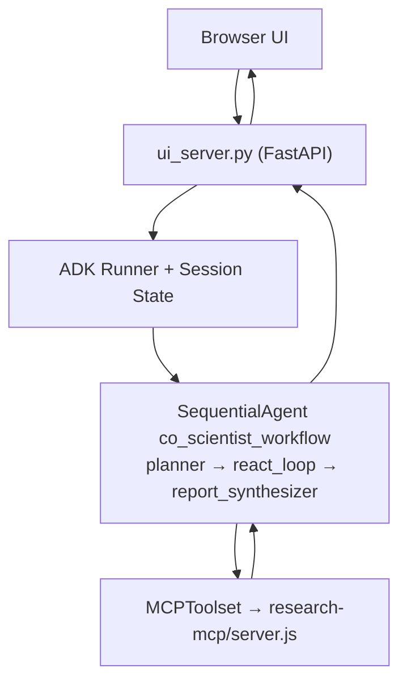
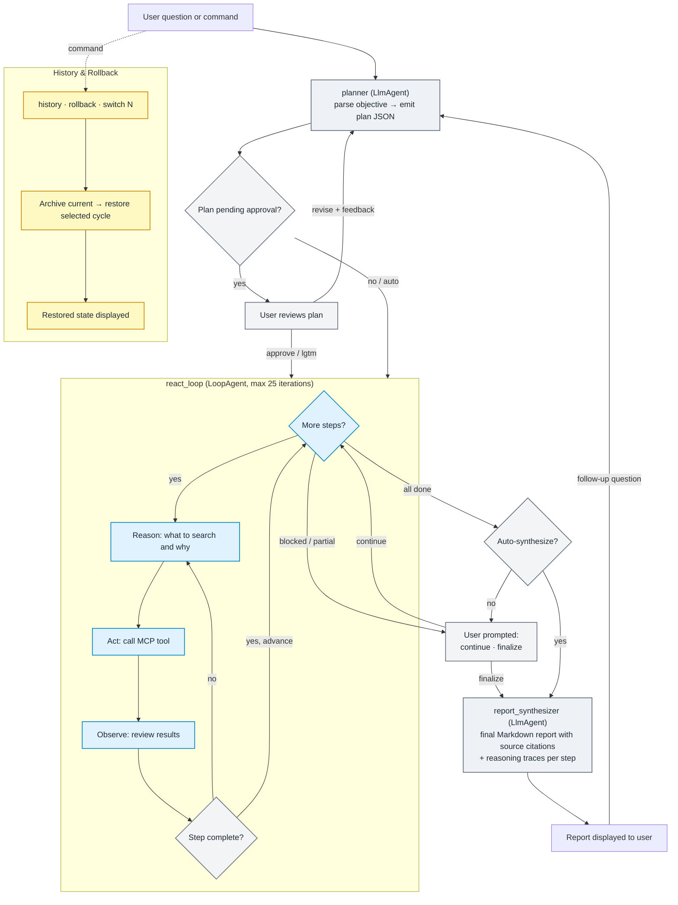

# AI Co-Scientist

An agentic AI research assistant that synthesizes evidence across biomedical databases to guide pre-clinical decisions.

## What It Does

The AI Co-Scientist helps biomedical researchers evaluate therapeutic targets and research directions before human trials by:

- **Synthesizing evidence across 19 databases** — genomics, literature, clinical trials, protein structure, pathways, safety, and more
- **Generating query-specific execution plans** with explicit tool and data-source proposals
- **Requiring human plan approval or revision** before evidence tools run
- **Running iterative evidence-gathering loops** via a ReAct (Reason → Act → Observe) cycle
- **Producing structured final reports** with inline citations, limitations, and suggested next steps
- **Exporting reports as PDF** with full source attribution

### Databases

| Category | Sources |
|----------|---------|
| **Genomics & Variants** | Open Targets Platform, gnomAD, 1000 Genomes, Ensembl VEP |
| **Clinical Trials** | ClinicalTrials.gov |
| **Literature & Researchers** | PubMed, OpenAlex |
| **Protein Structure & Function** | AlphaFold, UniProt |
| **Pathways & Interactions** | Reactome, STRING |
| **Chemistry & Bioactivity** | ChEMBL, SureChEMBL |
| **Safety & Regulatory** | FDA FAERS |
| **Immunology** | IEDB |
| **Drug Nomenclature** | RxNorm |
| **Perturbation Signatures** | LINCS L1000 |
| **Clinical Variant Interpretation** | CIViC, ClinGen |

Genomics, chemistry, safety, and structural databases are accessed via BigQuery public datasets. Literature, clinical trials, protein, pathway, and researcher tools use live REST APIs.

## Architecture



The custom web UI (`ui/index.html`, `app.js`, `styles.css`) communicates with `ui_server.py`, which manages conversations, run orchestration, and PDF export. Under the hood it uses the Google ADK `Runner` with `InMemorySessionService`.

## Dynamic Workflow

Source of truth: `adk-agent/co_scientist/workflow.py`.



### ReAct Execution Loop

Each plan step is executed as a **Reason → Act → Observe** cycle inside a `LoopAgent`:

1. **Reason** — the step executor reads the current step goal and decides what tool to call and why
2. **Act** — calls an MCP tool (e.g., `search_pubmed`, `run_bigquery_select_query`)
3. **Observe** — reviews the tool results; if insufficient, reasons again and retries with a different query or tool
4. **Conclude** — when the step's completion condition is met, returns a structured result with a `reasoning_trace`

The reasoning trace captures the full decision chain per step and is stored alongside step results. The synthesizer uses these traces to ground source citations in the final report.

**Error recovery:** if the executor returns invalid output, the loop retries the step (up to 3 attempts) with a corrective prompt before marking it blocked and advancing.

## Available Tools

### MCP Tools (Live APIs)

| Category | Tools | Source |
|----------|-------|--------|
| **Clinical Trials** | `search_clinical_trials`, `get_clinical_trial`, `summarize_clinical_trials_landscape` | ClinicalTrials.gov |
| **Literature** | `search_pubmed`, `search_pubmed_advanced`, `get_pubmed_abstract` | PubMed (NCBI E-utilities) |
| **Researcher Discovery** | `search_openalex_works`, `search_openalex_authors`, `rank_researchers_by_activity`, `get_researcher_contact_candidates` | OpenAlex |
| **Protein Annotations** | `search_uniprot_proteins`, `get_uniprot_protein_profile` | UniProt REST |
| **Pathways & Networks** | `search_reactome_pathways`, `get_string_interactions` | Reactome, STRING |
| **Benchmarks** | `benchmark_dataset_overview`, `check_gpqa_access` | Hugging Face Datasets |

### BigQuery Datasets

All accessed via `list_bigquery_tables` and `run_bigquery_select_query` with read-only row/bytes guardrails.

| Dataset | Contents |
|---------|----------|
| **open_targets_platform** | Disease-target associations, genetic evidence, drugs, tractability |
| **ebi_chembl** | Bioactive compounds, target bioactivity (IC50/Ki/EC50), mechanism of action |
| **gnomad** | Population variant frequencies across diverse ancestries |
| **human_genome_variants** | 1000 Genomes Phase 3 variants, Platinum Genomes, Simons Diversity |
| **human_variant_annotation** | Ensembl variant annotations, SIFT/PolyPhen scores (hg19/hg38) |
| **deepmind_alphafold** | Predicted protein structures, pLDDT confidence, PDB/CIF URLs |
| **immune_epitope_db** | Immune epitopes, B-cell assays, MHC ligand binding, T-cell receptor data |
| **nlm_rxnorm** | Drug nomenclature, ingredient relationships, clinical drug pathways |
| **fda_drug** | FAERS adverse event reports, drug labels, NDC listings, enforcement actions |
| **umiami_lincs** | L1000 perturbation signatures: cell lines, small molecules, readouts |
| **ebi_surechembl** | Chemical structures extracted from patents |
| **hackathon_data** | CIViC clinical variant interpretations, ClinGen gene-disease validity, GTEx tissue expression |

## User Commands

| Command | When | What it does |
|---------|------|-------------|
| `approve` / `yes` / `lgtm` / `go ahead` | Plan pending approval | Approve the plan and start execution |
| *(any other text while plan is pending)* | Plan pending approval | Treat as revision feedback — planner regenerates |
| `continue` / `next` / `go` | Execution paused | Resume executing remaining plan steps |
| `finalize` / `summarize now` | Any time after execution | Skip remaining steps and generate final report |
| `history` | Any time | List all archived + active research cycles |
| `rollback` | Any time | Archive current cycle and restore the most recent prior cycle |
| `switch N` | Any time | Archive current cycle and restore cycle number N |
| *(new question)* | After a report | Archives current cycle, starts fresh planning |

## Guardrails

- **HITL plan gate** — `before_agent_callback` blocks the ReAct loop and synthesizer until the plan is approved.
- **ReAct retry** — parse/validation errors trigger automatic retry (up to 3 attempts per step) before marking the step blocked.
- **Error callbacks** — `on_model_error_callback` and `on_tool_error_callback` surface rate-limit and tool failures to the user instead of silently crashing.
- **Step renumbering** — follow-up plans with non-sequential IDs are canonically renumbered to `S1, S2, ...`.
- **Source citations** — final reports cite human-readable database names (PubMed, ClinicalTrials.gov, etc.), never raw tool names or JSON URLs.
- **Research history** — up to 10 prior research cycles are archived with full state; rollback restores any previous cycle.
- **BigQuery guardrails** — read-only queries with configurable max rows (default 200, hard cap 1000) and bytes-billed limits.

## Example Queries

```
Evaluate LRRK2 as a drug target for Parkinson disease — what is the genetic evidence, druggability, and competitive landscape?
```
```
Is KRAS G12C structurally druggable? What do predicted protein structures and known interaction partners suggest about tractable binding sites?
```
```
What are the population-level variant frequencies for BRCA1, and which variants are classified as clinically significant?
```
```
What post-marketing safety signals exist for JAK inhibitors, and how selective are they across the kinase family?
```
```
What immune epitopes are known for PD-L1, and which signaling pathways does it participate in?
```
```
Who are the most active researchers working on CAR-T therapy for solid tumors, and what are the recent breakthroughs?
```

## Quick Start

### Prerequisites
- Python 3.10+
- Node.js 18+
- Optional local auth: Google API key ([get one free](https://aistudio.google.com/apikey))
- Optional Vertex auth: `gcloud` CLI + Application Default Credentials

### Setup

```bash
# 1. Clone and install
git clone <repo-url>
cd <repo>

# 2. Create and activate a project virtualenv
python -m venv .venv
source .venv/bin/activate

# 3. Install MCP server dependencies
cd research-mcp
npm install

# 4. Install agent dependencies
cd ../adk-agent
pip install -r requirements.txt

# 5a. Local mode auth (AI Studio API key)
cp .env.local.example .env
# then edit .env and set GOOGLE_API_KEY
# optional for BigQuery tools (ADC):
# gcloud auth application-default login
# optional for gated Hugging Face datasets (e.g., GPQA):
# set HF_TOKEN in .env

# 5b. Vertex mode auth (project-backed)
cp .env.vertex.example .env
# then edit GOOGLE_CLOUD_PROJECT / GOOGLE_CLOUD_LOCATION
# and authenticate with:
# gcloud auth application-default login
```

Keep the same shell with `.venv` activated for all commands below.

### Run

**Web UI (primary):**

```bash
cd adk-agent
python ui_server.py
```

Opens the custom web interface at `http://localhost:8080` with conversation management, real-time activity tracking, report panel, and PDF export.

**ADK CLI / ADK Web UI (alternative):**

```bash
cd adk-agent
adk run co_scientist    # interactive terminal
adk web .               # ADK built-in web UI
```

**Standalone CLI wrapper:**

```bash
cd adk-agent
python agent.py
python agent.py --query "Evaluate LRRK2 as a drug target in Parkinson disease"
```

## Cloud Run Deployment

```bash
PROJECT_ID="your-project-id" \
REGION="us-central1" \
SERVICE_NAME="ai-co-scientist" \
bash scripts/deploy_cloud_run.sh
```

The deploy script builds a container image via Cloud Build, then deploys to Cloud Run with Vertex AI auth and the full BigQuery dataset allowlist pre-configured.

### Runtime endpoints (Cloud Run)
- `GET /healthz` — readiness and config status
- `POST /api/query` — submit a research question
- `GET /api/conversations` — list conversations
- `GET /api/conversations/{id}` — conversation detail with iterations
- `GET /api/tasks/{id}/report.pdf` — export report as PDF

## Project Structure

```
├── adk-agent/              # AI Co-Scientist Agent (Python)
│   ├── agent.py            # ADK-native CLI wrapper (interactive/single query)
│   ├── ui_server.py        # Custom web UI server (FastAPI, primary entrypoint)
│   ├── report_pdf.py       # PDF report generation
│   ├── server.py           # Minimal FastAPI HTTP wrapper (legacy)
│   ├── co_scientist/
│   │   ├── __init__.py     # Exports root_agent for `adk run` / `adk web`
│   │   └── workflow.py     # Workflow graph, HITL, history/rollback, callbacks
│   ├── ui/
│   │   ├── index.html      # Landing page and chat interface
│   │   ├── app.js          # Client-side application logic
│   │   └── styles.css      # UI styles
│   ├── .adk/               # ADK local sessions/artifacts (created at runtime)
│   └── test_*.py           # Regression tests
│
├── research-mcp/           # Research Tools Server (Node.js)
│   ├── server.js           # MCP tool server (18 tools)
│   ├── data/               # Local datasets
│   └── test-tools.js       # Optional manual MCP tool test script
│
├── scripts/
│   └── deploy_cloud_run.sh # Build + deploy to Cloud Run with Vertex env
│
├── Dockerfile              # Cloud Run image (Python + Node runtime)
├── .dockerignore           # Build context guardrails
└── README.md               # This file
```

## Data Sources

### Live APIs
- **[ClinicalTrials.gov](https://clinicaltrials.gov/)** — Clinical trial registry and results
- **[PubMed / NCBI](https://pubmed.ncbi.nlm.nih.gov/)** — Biomedical literature and abstracts
- **[OpenAlex](https://openalex.org/)** — Scholarly works, authors, and citation data
- **[UniProt](https://www.uniprot.org/)** — Protein sequence, function, and annotation
- **[Reactome](https://reactome.org/)** — Curated biological pathway database
- **[STRING](https://string-db.org/)** — Protein-protein interaction networks

### BigQuery Public Datasets
- **[Open Targets Platform](https://platform.opentargets.org/)** — Disease-target associations, genetic evidence, tractability
- **[ChEMBL](https://www.ebi.ac.uk/chembl/)** — Bioactive compound and target bioactivity data
- **[gnomAD](https://gnomad.broadinstitute.org/)** — Population variant frequencies
- **[1000 Genomes](https://www.internationalgenome.org/)** — Phase 3 variants, population structure
- **[Ensembl VEP](https://www.ensembl.org/vep)** — Variant functional consequence annotations
- **[AlphaFold](https://alphafold.ebi.ac.uk/)** — Predicted protein structures and confidence scores
- **[IEDB](https://www.iedb.org/)** — Immune epitope data, B-cell and T-cell assays
- **[RxNorm](https://www.nlm.nih.gov/research/umls/rxnorm/)** — Drug nomenclature and relationships
- **[FDA FAERS](https://open.fda.gov/data/faers/)** — Adverse event reports, drug labels, enforcement
- **[LINCS L1000](https://lincsproject.org/)** — Chemical and genetic perturbation signatures
- **[SureChEMBL](https://www.surechembl.org/)** — Chemical structures from patent literature
- **[CIViC](https://civicdb.org/)** — Clinical interpretation of cancer variants
- **[ClinGen](https://clinicalgenome.org/)** — Gene-disease clinical validity

## Testing

```bash
cd adk-agent
../.venv/bin/python -m py_compile agent.py server.py ui_server.py report_pdf.py co_scientist/workflow.py
```

Notes:
- External network tests were removed from the default suite to keep CI/dev runs deterministic and fast.
- Generated artifacts in `adk-agent/reports/` are runtime outputs and can be safely deleted.
